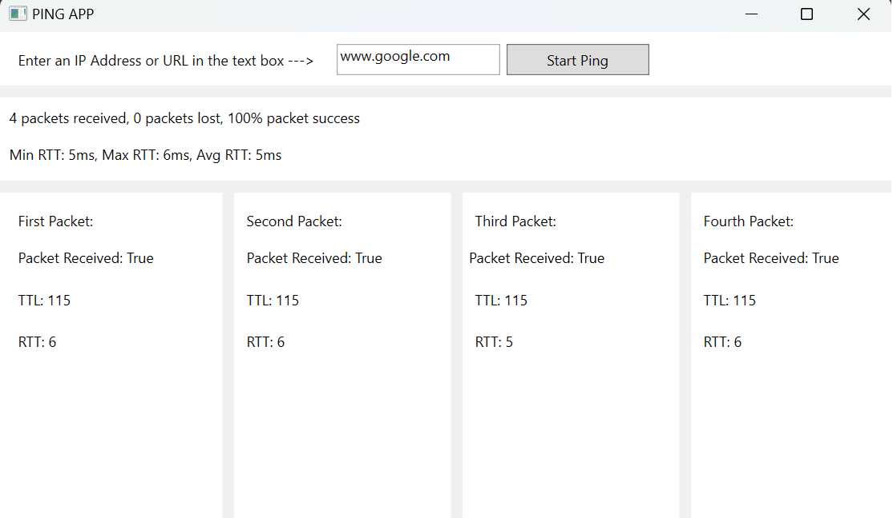

 

  

  <h3 align="center">PING APP</h3>

  

    A network diagnostics tool for Windows with a user-friendly interface
     
     
    <a href="https://github.com/Fabio-Mignone/PING-APP"><strong>Explore the docs »</strong></a>
     
     
    <a href="https://github.com/Fabio-Mignone/PING-APP">View Demo</a>
    .
    <a href="https://github.com/Fabio-Mignone/PING-APP/issues">Report Bug</a>
    .
    <a href="https://github.com/Fabio-Mignone/PING-APP/issues">Request Feature</a>
  

    

## Table Of Contents

* [About the Project](#about-the-project)
* [Built With](#built-with)
* [Getting Started](#getting-started)
  * [Prerequisites](#prerequisites)
  * [Installation](#installation)
* [Usage](#usage)
* [Roadmap](#roadmap)
* [Contributing](#contributing)
* [License](#license)
* [Authors](#authors)
* [Acknowledgements](#acknowledgements)

## About The Project

Introduction:
In today's interconnected world, a stable and reliable network connection is crucial for seamless communication and efficient workflow. However, network issues can arise unexpectedly, causing frustration and hindering productivity. To simplify network troubleshooting and monitoring, a user-friendly network diagnostics tool for Windows has been developed. This tool empowers users to quickly ping IP addresses or URLs, test connectivity, view essential metrics such as round-trip times and TTL values, and calculate data loss percentage and average round-trip time.

Ease of Use:
One of the standout features of this network diagnostics tool is its user-friendly interface. Designed with simplicity in mind, it provides a straightforward and intuitive platform for users to perform essential network diagnostics tasks. The tool allows users to effortlessly enter IP addresses or URLs and initiate ping tests with just a few clicks. By eliminating the need for complex command-line operations, even non-technical users can easily navigate the tool and conduct network connectivity tests efficiently.

## Built With

This App is built using the .NET Core 7.0 SDK with a WPF (Windows Presentation Foundation) project. It utilizes C# for the back-end logic and XAML for the front-end interface.

## Getting Started

The easiest way to run this app on your PC is by downloading the installer and following the guided process. Alternatively, you can download the source code and run the project from the .sln file.

### Prerequisites

To run the app by downloading the source code, you will need a version of Visual Studio that has the .NET Core 7.0 SDK installed and the necessary packages to execute a WPF project.

### Installation

Installer: Execute the installer on your PC and follow the guided process. Once completed, you will find the app installed and ready to run on your computer.

.sln File: Open the solution in Visual Studio (ensure that you have .NET Core 7.0 and all the required packages for a WPF project installed). Then, press F5 or click on the specific button to execute the solution. This will compile and launch the app, making it ready for use.

## Usage

This app works perfectly on Windows, ensuring all the common features you can expect from a Windows application.

## Roadmap

See the [open issues](https://github.com/Fabio-Mignone/PING-APP/issues) for a list of proposed features (and known issues).

## Contributing

Contributions are what make the open source community such an amazing place to be learn, inspire, and create. Any contributions you make are **greatly appreciated**.
* If you have suggestions for adding or removing projects, feel free to [open an issue](https://github.com/Fabio-Mignone/PING-APP/issues/new) to discuss it, or directly create a pull request after you edit the *README.md* file with necessary changes.
* Please make sure you check your spelling and grammar.
* Create individual PR for each suggestion.
* Please also read through the [Code Of Conduct](https://github.com/Fabio-Mignone/PING-APP/blob/main/CODE_OF_CONDUCT.md) before posting your first idea as well.

### Creating A Pull Request

1. Fork the Project
2. Create your Feature Branch (`git checkout -b feature/AmazingFeature`)
3. Commit your Changes (`git commit -m 'Add some AmazingFeature'`)
4. Push to the Branch (`git push origin feature/AmazingFeature`)
5. Open a Pull Request

## License

Distributed under the GPL-3.0 License. See [LICENSE](https://github.com/Fabio-Mignone/PING-APP/blob/main/LICENSE.md) for more information.

## Authors

* **Mignone Fabio** - *Computer Science Student* - [Mignone Fabio](https://github.com/Fabio-Mignone)
